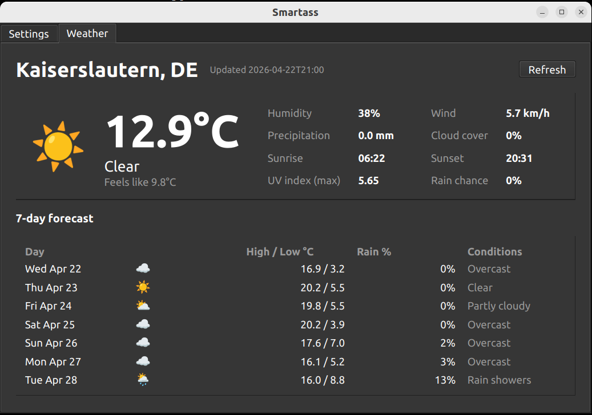

<!-- TOC -->
* [Smartass](#smartass)
  * [What it does](#what-it-does)
  * [Architecture at a glance](#architecture-at-a-glance)
* [For Users](#for-users)
  * [Install](#install)
    * [Option A — prebuilt `.deb`](#option-a--prebuilt-deb)
    * [Option B — build from source](#option-b--build-from-source)
    * [After install](#after-install)
  * [Using the app](#using-the-app)
    * [Settings tab](#settings-tab)
    * [Weather plugin](#weather-plugin)
    * [Import / export](#import--export)
  * [Uninstall](#uninstall)
  * [Configuration and data paths](#configuration-and-data-paths)
  * [Troubleshooting](#troubleshooting)
* [For Plugin Developers](#for-plugin-developers)
  * [What a plugin looks like](#what-a-plugin-looks-like)
  * [`manifest.toml`](#manifesttoml)
  * [`PluginInterface`](#plugininterface)
  * [Settings schema](#settings-schema)
  * [Per-plugin data and D-Bus surface](#per-plugin-data-and-d-bus-surface)
  * [Installing a user plugin](#installing-a-user-plugin)
* [For Contributors](#for-contributors)
  * [Repo layout](#repo-layout)
  * [Developer dependencies](#developer-dependencies)
  * [Running tests](#running-tests)
  * [Local iteration without reinstalling](#local-iteration-without-reinstalling)
  * [Building the `.deb`](#building-the-deb)
  * [CI / release automation](#ci--release-automation)
  * [License](#license)
<!-- TOC -->

# Smartass

A desktop smart-assistant app for Ubuntu. It lives as a robot icon in the
GNOME top panel; clicking it opens a tabbed window with an always-visible
**Settings** tab plus one tab per enabled plugin.

## What it does

- **Tray-resident app.** An AppIndicator-style icon sits in the GNOME top
  bar. Left-click toggles the main window; right-click offers Show/Hide,
  Restart daemon, and Quit tray.
- **Plugin system.** Each plugin is a directory with a `manifest.toml` and
  a Python module. Plugins are discovered from
  `/usr/share/smartass/plugins/` (system / bundled) and
  `~/.local/share/smartass/plugins/` (user-installed). Enabling a plugin
  in the Settings tab adds its tab to the window; disabling removes it.
- **Settings forms.** Each plugin declares a typed settings schema
  (strings, ints with bounds, booleans, dropdowns, secrets). The Settings
  tab auto-renders the form — plugins never touch Qt for their settings.
- **Import / export.** Export your whole config to a TOML file and import
  one back, with `merge` or `replace` strategies.
- **Split daemon + tray.** A `smartass-daemon` user service hosts plugins
  and does the work (polling, data fetching, persistence). The tray is a
  separate Qt6 process that talks to the daemon over the session D-Bus at
  `ai.talonic.Smartass`. The daemon keeps running even when the window is
  closed, and survives a tray crash.
- **Bundled: Weather.** Current conditions + 7-day forecast via
  [Open-Meteo](https://open-meteo.com/) (no API key, user-typed city).
  Hero card with big emoji + temperature + feels-like, a details grid
  (humidity, wind, precipitation, cloud cover, sunrise, sunset, UV index,
  rain probability) and a 7-day grid.
- **Theme-aware.** Symbolic tray icon auto-recolors for dark / light
  panels. All UI text colors follow the active Qt palette.
- **Autostart.** The daemon is a systemd *user* service, enabled
  globally at install time and started on login. The tray is launched
  via XDG autostart from `/etc/xdg/autostart/smartass-tray.desktop`.

## Architecture at a glance

```
  GNOME top bar
        │ left-click
        ▼
  smartass-tray (PySide6/Qt6)
        │ session D-Bus: ai.talonic.Smartass
        ▼
  smartass-daemon (systemd --user)
        │
        └── PluginManager
              ├── weather (bundled)
              └── …your plugins…
```

---

# For Users

### Install

#### Option A — prebuilt `.deb`

The [Releases page](https://github.com/saurabheights/smartass/releases)
ships `.deb` files for Ubuntu 22.04 (jammy), 24.04 (noble), and 25.10
(questing). Pick the one matching your Ubuntu release and:

```bash
sudo apt-get install -y ./smartass_<version>_amd64_<codename>.deb
```

The `.deb` bundles its own Python venv at `/opt/smartass/` (PySide6,
dbus-next, httpx, etc.), so the only runtime system dependencies are
Qt6 shared libraries and the GNOME AppIndicator extension.

#### Option B — build from source

You need Ubuntu 22.04+ and the Debian build tools:

```bash
sudo apt-get install -y devscripts dh-virtualenv python3-dev build-essential debhelper
```

Clone this repo, then:

```bash
poetry install          # one-time: creates the dev venv
task build-deb          # produces ../smartass_<version>_amd64.deb (5–10 min)
task install-service    # dpkg -i the fresh .deb, enable daemon, launch tray
```

`task install-service` calls `sudo dpkg -i`, so you'll get a sudo
password prompt.

#### After install

- The **daemon** is enabled as a systemd user service — it starts on
  every login from now on. Inspect with:
  ```bash
  systemctl --user status smartass-daemon.service
  journalctl --user -u smartass-daemon.service
  ```
- The **tray** launches automatically on login via XDG autostart. For
  the current session, `task install-service` also launches it
  immediately, so you don't need to log out and back in.
- The **tray icon** is a small robot in the top bar. On vanilla GNOME
  Shell you need the AppIndicator extension — on Ubuntu Desktop it's
  enabled by default. If the icon doesn't appear, see
  [Troubleshooting](#troubleshooting) below.

### Using the app

#### Settings tab

Always visible. Lists every plugin discovered from the system and user
plugin directories. For each plugin:

- **Enable / Disable** button toggles whether the plugin runs and shows
  its tab in the window. The change takes effect immediately.
- Clicking a plugin in the list opens its settings form. Typed fields,
  required-field validation, bounds-checking, and secret masking are
  all handled by the form renderer.
- **Save** persists to `~/.config/smartass/config.toml` and notifies
  the running plugin so it reacts immediately (e.g. Weather re-fetches
  for the new city rather than waiting for the next poll).

#### Weather plugin



Not enabled by default — opt in via Settings.

Once enabled:
- Hero card: big weather emoji + large current temperature + "Feels
  like …" + condition label.
- Details: humidity, wind speed, precipitation, cloud cover, sunrise,
  sunset, UV index (max), rain chance today.
- 7-day grid: day-of-week + emoji + high / low + rain % + condition.
- **Refresh** button forces an immediate re-fetch (via the daemon's
  `RefreshNow` D-Bus method); it does not wait for the `poll_minutes`
  interval.

Settings:
- `City` (string, required) — any city name Open-Meteo's geocoder
  recognizes.
- `Units` (`metric` / `imperial`) — controls temp and wind units.
- `Refresh every (minutes)` (1 – 240) — default 15.

#### Import / export

In the Settings tab:
- **Export…** writes your whole config to a TOML file of your choice.
- **Import…** loads a TOML file back. By default the import is a
  *merge* (current config updated in place); running plugins reload
  with the new values.

Exports default to `~/.local/share/smartass/exports/`.

### Uninstall

Two Taskfile commands:

```bash
# Remove the package, keep user config + data (safe for re-install)
task remove-service-keep-data

# Remove the package AND delete ~/.config/smartass, ~/.local/share/smartass,
# ~/.cache/smartass (permanent; prompts for confirmation)
task remove-service-with-all-data
```

Under the hood these are `sudo apt-get remove smartass` and
`sudo apt-get purge smartass` respectively, plus stop of the systemd
user service and the running tray process.

### Configuration and data paths

| Path | Purpose |
| --- | --- |
| `~/.config/smartass/config.toml` | Global + per-plugin settings (portable) |
| `~/.local/share/smartass/plugin_data/<id>/` | Per-plugin SQLite / runtime data |
| `~/.local/share/smartass/plugins/<id>/` | User-installed plugin directories |
| `~/.local/share/smartass/exports/` | Auto-named export bundles |
| `~/.cache/smartass/daemon.log` | Rotating daemon log (5 × 1 MB) |
| `~/.cache/smartass/tray.log` | Tray log |
| `/usr/share/smartass/plugins/weather/` | Bundled Weather plugin |
| `/opt/smartass/` | The dh-virtualenv that bundles Python + PySide6 + deps |
| `/usr/lib/systemd/user/smartass-daemon.service` | systemd user unit |
| `/etc/xdg/autostart/smartass-tray.desktop` | Tray autostart entry |

### Troubleshooting

**Tray icon doesn't appear.**
1. Confirm the tray process is running:
   ```bash
   pgrep -af smartass.tray
   ```
2. Confirm the GNOME AppIndicator extension is enabled:
   ```bash
   gnome-extensions list --enabled | grep -i appindicator
   ```
   If empty:
   ```bash
   sudo apt-get install -y gnome-shell-extension-appindicator
   gnome-extensions enable ubuntu-appindicators@ubuntu.com
   ```
   (a logout/login may be required the first time the extension is
   enabled).
3. Verify Smartass registered itself as a StatusNotifierItem:
   ```bash
   busctl --user call org.kde.StatusNotifierWatcher /StatusNotifierWatcher \
     org.freedesktop.DBus.Properties Get ss \
     org.kde.StatusNotifierWatcher RegisteredStatusNotifierItems
   ```
   You should see an entry whose properties include `Id = "Smartass"`.

**Daemon not reachable.**
```bash
systemctl --user status smartass-daemon.service
systemctl --user restart smartass-daemon.service
busctl --user call ai.talonic.Smartass /ai/talonic/Smartass \
  ai.talonic.Smartass.Core Ping
```

Expected Ping reply: `s "pong <version>"`.

**Weather tab shows "stale".**
The daemon couldn't reach Open-Meteo (or geocoding) for the last poll.
The tab falls back to the last good snapshot from SQLite. Check:
```bash
tail ~/.cache/smartass/daemon.log
```

Common causes: offline network, DNS issue, or an unreachable city name
(the geocoder returned no results).

---

# For Plugin Developers

A plugin is a directory with a `manifest.toml` and a Python module that
subclasses `PluginInterface`. The daemon discovers it, instantiates it
in its own process for background work, and re-instantiates it on the
tray side when the main window needs to render the plugin's tab.

### What a plugin looks like

```
<plugin_root>/<id>/
    manifest.toml
    plugin.py              # module named in manifest `entry`
    ui.py                  # optional; tab widget lives here by convention
    <private modules, assets…>
```

`<plugin_root>` is one of:
- `/usr/share/smartass/plugins/` — system-wide, shipped by a `.deb`
- `~/.local/share/smartass/plugins/` — per-user drop-in

### `manifest.toml`

```toml
[plugin]
id            = "myplugin"               # must match directory name
name          = "My Plugin"              # shown as the tab title
version       = "0.1.0"
api_version   = 1                        # PluginInterface contract version
description   = "Short blurb"
author        = "Your Name"
entry         = "plugin:MyPlugin"        # "<module>:<ClassName>"
icon          = "applications-science"   # themed icon name, or bundled path
permissions   = ["net.http"]             # subset of: net.http, fs.data, clipboard, ipc.dbus
```

The loader validates every field, rejects unknown permissions, and
enforces that `id` matches the parent directory name.

### `PluginInterface`

Abbreviated:

```python
class PluginInterface(ABC):
    id: str                              # set from manifest
    api_version: ClassVar[int] = 1

    def __init__(self, ctx: PluginContext) -> None: ...

    # --- Lifecycle (daemon-side) ---
    def on_load(self) -> None: ...       # sync init; open DB, read config
    async def on_start(self) -> None: ...# begin background work
    async def on_stop(self) -> None: ... # stop tasks, flush
    def on_unload(self) -> None: ...     # release resources

    # --- UI (tray-side) ---
    @abstractmethod
    def build_tab(self, parent) -> QWidget: ...

    # --- Settings ---
    @abstractmethod
    def settings_schema(self) -> SettingsSchema: ...
    def on_settings_changed(self, new: dict) -> None: ...

    # --- Import/export (opt-in portable state) ---
    def export_state(self) -> dict: ...
    def import_state(self, data: dict) -> None: ...
```

The same subclass is instantiated in both the daemon and the tray. The
daemon-side instance runs lifecycle hooks and background tasks; the
tray-side instance's only job is `build_tab()`.

`PluginContext` is injected per side:
- `config: PluginConfig` — typed getter/setter for this plugin's TOML section
- `data_dir: Path` — `~/.local/share/smartass/plugin_data/<id>/`
- `log: Logger`
- `http: AsyncHttpClient | None` — present iff `net.http` granted
- `permissions: frozenset[str]`

Bundled Weather is the reference implementation: see
[`smartass/plugins/weather/`](smartass/plugins/weather/).

### Settings schema

Declarative, Qt-free. The Settings tab auto-renders a form from
whatever your plugin returns from `settings_schema()`:

```python
def settings_schema(self) -> SettingsSchema:
    return SettingsSchema(fields=(
        StringField(key="city", label="City", default="Berlin", required=True),
        SelectField(key="units", label="Units",
                    default="metric", options=("metric", "imperial")),
        IntField(key="poll_minutes", label="Refresh every (min)",
                 default=15, min=1, max=240),
    ))
```

Available field types: `StringField`, `IntField(min, max)`, `BoolField`,
`SelectField(options)`, `SecretField`. Each validates its input and
serializes itself for the schema form renderer.

### Per-plugin data and D-Bus surface

- Store runtime data (SQLite, caches) under `ctx.data_dir`.
- The daemon automatically exports each running plugin as a D-Bus
  object at `/ai/talonic/Smartass/plugins/<id>` under the interface
  `ai.talonic.Smartass.Plugin`. The common method `GetState()` returns
  a JSON-encoded snapshot of whatever you expose via `last_snapshot()`.
- You can expose plugin-specific D-Bus methods by implementing them on
  your class (e.g. Weather's `refresh()` is reachable as `RefreshNow`
  via the generic `PluginObject` adapter).
- The Settings tab triggers `on_settings_changed()` + `refresh()`
  immediately on Save — settings changes are reactive without waiting
  for the next poll.

### Installing a user plugin

```bash
mkdir -p ~/.local/share/smartass/plugins
cp -r /path/to/myplugin ~/.local/share/smartass/plugins/
systemctl --user restart smartass-daemon.service
```

Or, from the Settings tab (once `InstallPlugin` is implemented; today
drop-in only). The daemon will discover the plugin on its next
`ReloadDaemon` or restart. Enable it from the Settings tab.

---

# For Contributors

### Repo layout

```
smartass/
  core/              # pure-Python, no Qt/D-Bus imports
    paths.py         # XDG-compliant path helpers
    manifest.py      # manifest.toml loader + validation
    plugin_interface.py  # PluginInterface ABC, SettingsSchema, fields
    config.py        # ConfigStore, PluginConfig, migrations
    dbus_names.py    # D-Bus naming constants
  daemon/
    __main__.py      # entrypoint (systemd user service)
    service.py       # Core D-Bus service
    plugin_manager.py  # discovery + lifecycle
    plugin_object.py # per-plugin D-Bus adapter (GetState, RefreshNow)
    http.py          # shared AsyncHttpClient
  tray/              # PySide6 / Qt6
    __main__.py      # entrypoint (XDG autostart)
    app.py           # QApplication bootstrap
    tray_icon.py
    main_window.py
    settings_tab.py
    schema_form.py   # SettingsSchema -> Qt form renderer
    daemon_client.py # QtDBus proxy to Core
  plugins/
    weather/         # reference plugin (Open-Meteo)
assets/icons/        # tray icons (normal + symbolic)
debian/              # packaging (dh-virtualenv)
.github/workflows/   # CI (ci.yml) + release builds (build-debs.yml)
docs/
  superpowers/specs/     # design spec
  superpowers/plans/     # implementation plan
  images/                # screenshots
tests/
  core/ daemon/ plugins/ integration/
```

### Developer dependencies

```bash
sudo snap install task --classic      # Taskfile runner (required)
sudo apt-get install -y dbus          # provides dbus-run-session for tests
poetry install                         # runtime + dev deps in a poetry venv
pre-commit install                     # optional: ruff check/format on commit
```

### Running tests

Most tests run under plain pytest; D-Bus integration tests need a
private session bus, so they go through `dbus-run-session`:

```bash
# Unit + fast tests
poetry run pytest tests/core tests/plugins \
  tests/daemon/test_http.py \
  tests/daemon/test_plugin_manager_discovery.py \
  tests/daemon/test_plugin_manager_lifecycle.py

# D-Bus integration tests (private bus)
dbus-run-session -- poetry run pytest \
  tests/daemon/test_service_core.py tests/integration
```

The CI workflow (`.github/workflows/ci.yml`) runs both suites on Python
3.10–3.13.

### Local iteration without reinstalling

For daemon / plugin code:

```bash
dbus-run-session -- poetry run python -m smartass.daemon &
# Poke the D-Bus API with busctl or your own client
```

For tray code — tray needs the real session bus + a display, so you
develop against the installed daemon and `sudo rsync` changed files
into `/opt/smartass/lib/python3.10/site-packages/smartass/`, then
relaunch the tray. For production always go through
`task build-deb && task install-service`.

### Building the `.deb`

```bash
task build-deb          # runs `debuild -us -uc -b`, writes to ../
task install-service    # dpkg -i, enables daemon, launches tray
```

dh-virtualenv bundles a self-contained Python venv with PySide6 and
all other deps into `/opt/smartass/`. The .deb is therefore large
(~200 MB) but has no pip-install steps at install time.

### CI / release automation

Two workflows:
- **`.github/workflows/ci.yml`** — on push/PR to main: runs tests on
  Python 3.10–3.13 with coverage upload.
- **`.github/workflows/build-debs.yml`** — on `v*` tag push or manual
  dispatch: builds the `.deb` in ubuntu:22.04 / 24.04 / 25.10
  containers and publishes them to a GitHub release (tag push →
  `latest`; workflow_dispatch → prerelease).

Cut a release:
```bash
# bump version in pyproject.toml + smartass/__init__.py + debian/changelog
git commit -am "chore: release v0.1.2"
git tag v0.1.2
git push origin main --tags
```

The workflow picks up the tag, builds on all three Ubuntu targets, and
creates a release at `https://github.com/saurabheights/smartass/releases/tag/v0.1.2`.

### License

Distributed under the terms of the MIT License — see
[`LICENSE`](LICENSE) (if present) or the `[project]` `license` field
in `pyproject.toml`.
